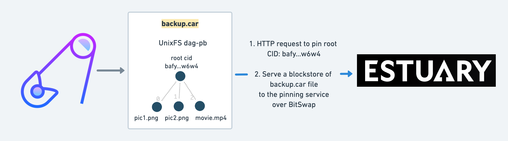

# Auspinner


`auspinner` is a stateless CLI tool to easily pin CAR files to IPFS pinning services. It's essentially a client for the [IPFS Pinning Service API](https://ipfs.github.io/pinning-services-api-spec/) that speaks HTTP and [Bitswap](https://docs.ipfs.io/concepts/bitswap/).



Made with ❤️ during [Protocol Labs Launchpad](https://protocol.ai/blog/announcing-pl-launchpad/)

## Features

- List pins and by status
- Delete pins by their pin request ID
- Add pins
  - Serve them over Bitswap by connecting to the delegates returned from the pinning service
  - Alternatively, if no delegates are returned, the `--use-origins` flag uses libp2p NAT port mapping to get a public address which is passed in the origins to the pinning service

## Supported pinning services

Auspinner has been tested to work with:

- [nft.storage](https://nft.storage/)
- [web3.storage](https://web3.storage/)
- [pinata](https://www.pinata.cloud/)
- [estuary](https://estuary.tech/)
- [Filebase](https://docs.filebase.com/storage-networks/ipfs/ipfs-pinning)

Check out [the pinning service compliance reports](https://ipfs-shipyard.github.io/pinning-service-compliance/) to see which services are correctly implementing the IPFS Pinning Service API Spec.

## Usage demo


## Credits

Big thanks to a bunch of brilliant developers who either helped along the way or built tools and libraries that Auspinner uses:

- https://github.com/aschmahmann
- https://github.com/lidel
- https://github.com/ajnavarro
- https://github.com/sgtpooki
- https://github.com/willscott
- https://github.com/marten-seemann

<!--

## **Usage**

```
Usage: auspinner [OPTIONS]

Options:

```

-->
